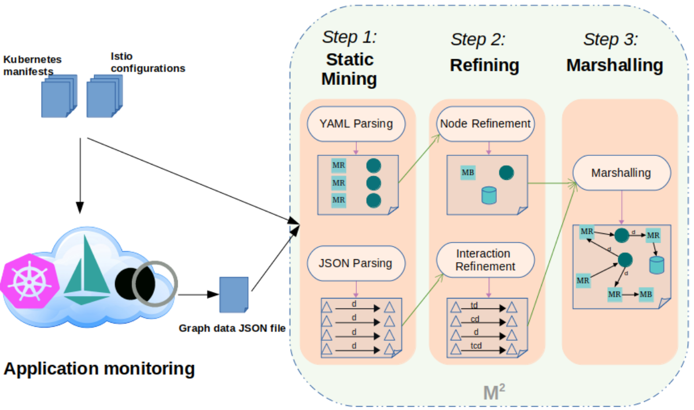
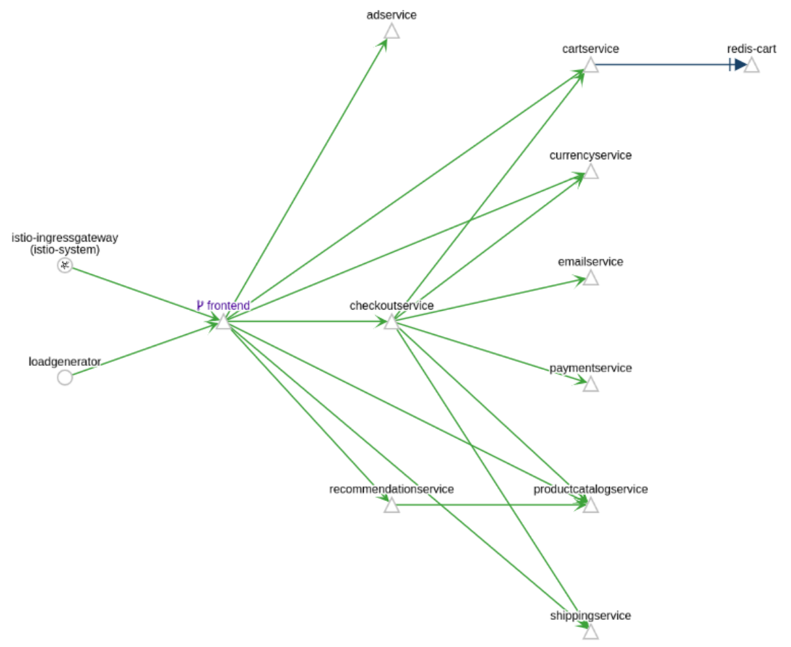
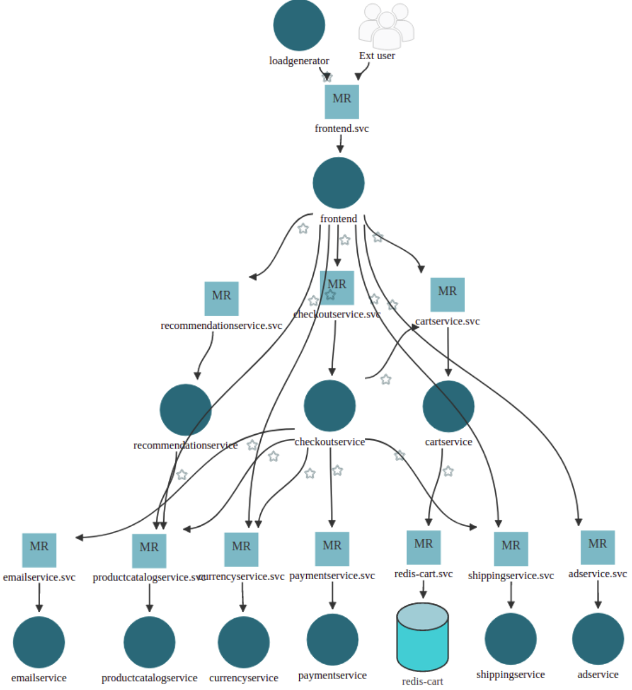

# Mining the Architecture of Microservice-based Applications

M<sup>2</sup> is a tool for mining the architecture of microservice-based applications from their [Istio](https://istio.io/latest/) and [Kiali](https://kiali.io/) enabled Kubernetes deployment. M<sup>2</sup> generates the [microTOSCA](https://github.com/di-unipi-socc/microTOSCA) specifications of the architecture of the application which represent the architecture of the application as topology graph where nodes are services, databases and integration patterns that form the application, and arcs represent interactions between node components of the application. The generated specifications which is in YAML format then can be imported by [microFreshner](https://github.com/di-unipi-socc/microFreshener) for visualizing, analyzing and also refactoring. 


## Demo
### a) Monitoring the microsrvice-based application:
For mining the architecture of a microservice-based application, the application should be deployed on an Istio enabled Kubernetes cluster using its Kubernetes/Istio( consisting of Gateway configuration and traffic management controlling rules) manifest files (Information pertaining to setting up the Kubernetes cluster provider platform and installing Istio can be find [here](https://istio.io/latest/docs/setup/platform-setup/)). Here we used [Online Boutique](https://github.com/GoogleCloudPlatform/microservices-demo) application for this demo. By generating the service mesh of the application using Istio and visualize it by Kiali, which is as following, the structure of service mesh could be observed.

### b) Generating graph data JSON file of the service mesh by Kiali:
Graph data JSON file of the service mesh can be generated by accessing Kiali public API by pointing your browser to following URL.
```html
$KIALI_URL/api/namespaces/graph?namespaces=<$NAMESPACE>&graphType=service
```
download the graph data JSON file and place it together with Kubernetes/Istio manifest files. Example of such a file is available [here](./data/examples/OnlineBoutique/kiali.json) in case of Online Boutique application.
#### Reminder:
Every Kubernetes manifest and Every Istio configuration must be in separated single files in order to get the correct output.
### c) Installing M<sup>2</sup>:
For using M<sup>2</sup> first you should clone the repository:
```c++
$ git clone git@github.com/di-unipi-socc/M2.git
```
### d) Generate executable jar file of M<sup>2</sup>:
```c++
$ sudo mvn clean compile assembly:single
```
Ordering the above command results in creation of "target" folder which contains an executable jar file called <b>M2Miner-1.0.jar</b>  
Creating the executable jar file is required only for the first time of using M<sup>2</sup>, unless there is a modification or update to source code in the remote repository.

### e) Running M<sup>2</sup> miner:
For running M<sup>2</sup> miner once all the required inputs are provided, access the "target" folder,
```c++
$ cd target
```
and run the jar file by issuing the following command:
```java
$ java -jar  M2Miner-1.0.jar <inputFilesDirectory> [-i]
```
where "inputFileDirectory" is the complete path to the folder containing all the input files (i.e., Kubernetes/Istio manifests and graph data JSON file) for M<sup>2</sup>, and an optional parameter "-i" for enabling interactive node refinement.
   The microTOSCA specification output file will be generated and stored in the same folder as input directory. Example of such a file is available [here](./data/examples/OnlineBoutique/microTOSCA.yml) in case of Online Boutique application.
### f) Visualizing the mined architecture by microFreshner:
The generated microTOSCA representation of architecture of the application by M<sup>2</sup> can be visualized by [microFreshner](https://github.com/di-unipi-socc/microFreshener). The following is visualized microTOSCA specification of architecture of Online Boutique application. 

