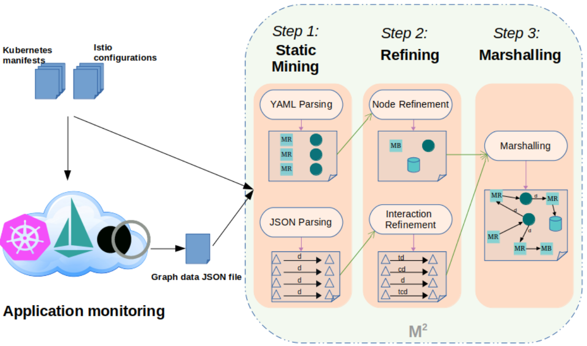

# Mining the Architecture of Microservice-based Applications

microTOM is a tool for mining the architecture of microservice-based applications from their [Istio](https://istio.io/latest/) and [Kiali](https://kiali.io/) enabled Kubernetes deployment. microTOM generates the [microTOSCA](https://github.com/di-unipi-socc/microTOSCA) specifications of the architecture of the application which represent the architecture of the application as topology graph where nodes are services, databases and integration patterns that form the application, and arcs represent interactions between node components of the application. The generated specifications which is in YAML format then can be imported by [microFreshner](https://github.com/di-unipi-socc/microFreshener) for visualizing, analyzing and also refactoring. 


## Demo
### a) Monitoring the microsrvice-based application:
For mining the architecture of a microservice-based application, the application should be deployed on an Istio enabled Kubernetes cluster using its Kubernetes/Istio( consisting of Gateway configuration and traffic management controlling rules) manifest files (Information pertaining to setting up the Kubernetes cluster provider platform and installing Istio can be find [here](https://istio.io/latest/docs/setup/platform-setup/)). Here we used [Online Boutique](https://github.com/GoogleCloudPlatform/microservices-demo) application for this demo. By generating the service mesh of the application using Istio and visualize it by Kiali, which is as following, the structure of service mesh could be observed.

### b) Generating graph data JSON file of the service mesh by Kiali:
Graph data JSON file of the service mesh can be generated by accessing Kiali public API by pointing your browser to following URL.
```html
$KIALI_URL/api/namespaces/graph?namespaces=<$NAMESPACE>&graphType=service
```
download the graph data JSON file and place it together with Kubernetes/Istio manifest files. Example of such a file is available [here](./data/examples/OnlineBoutique/kiali.json) in case of Online Boutique application.
#### Reminder:
Every Kubernetes manifest and Every Istio configuration must be in separated single files in order to get the correct output.
### c) Installing microTOM:
For using microTOM you should first clone this repository, and then create an executable JAR file by running 
```c++
$ mvn clean install
```
Ordering the above command results in creation of a `target` folder which contains an executable jar file called `microTOM-1.0.jar`  

### d) Running microTOM:
The generated `microTOM-1.0.JAR` can then be run as follows (assuming the main project folder being the current working directory):
```java
$ java -jar target/microTOM-1.0.jar <workDir> [-i]
```
where `workDir` is the path to a folder containing all the necessary input files (i.e., Kubernetes manifests and Kiali's graph data JSON file) for microTOM, whilst the option `-i` enables activating the interactive node refinement.
The microTOSCA specification output file will be generated and stored in the same `workDir`. An example of such a file is available [here](./data/examples/OnlineBoutique/microTOSCA.yml) in case of Online Boutique application.
### e) Visualizing the mined architecture by microFreshner:
The generated microTOSCA representation of architecture of the application by microTOM can be visualized by [microFreshner](https://github.com/di-unipi-socc/microFreshener). The following is visualized microTOSCA specification of architecture of Online Boutique application. 

